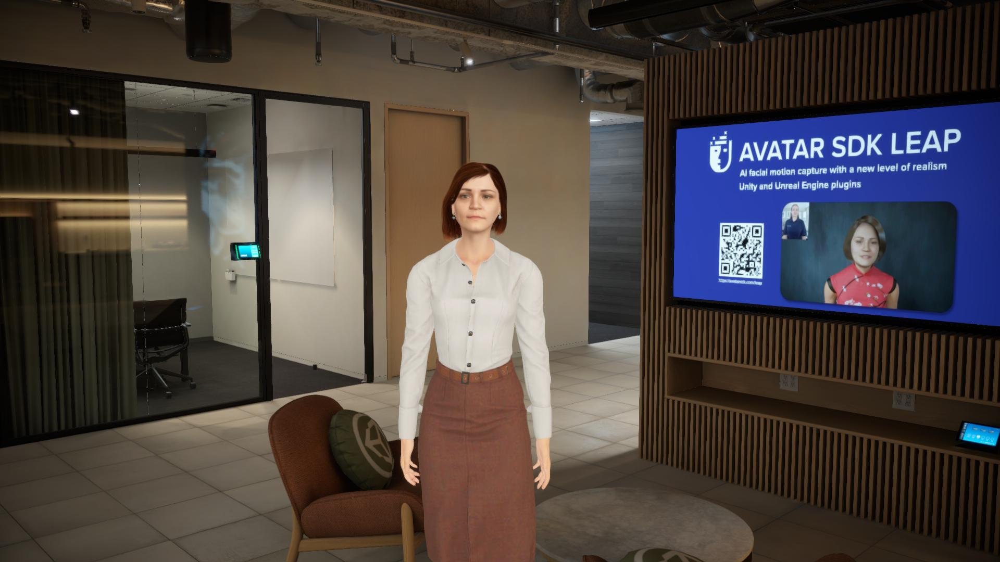

# Leap Unity HDRP Sample

An advanced sample project demonstrating high-quality Leap avatar rendering in Unity's High Definition Render Pipeline (HDRP).

## Features

 * Demonstrates Leap avatar integration and rendering in HDRP environment
 * Uses the [Unity Japan Office](https://assetstore.unity.com/packages/3d/environments/unityjapanoffice-152800) environment asset
 * Preloads a sample Leap avatar from Assets

## Requirements

### Essential

 * Unity 6 (6000.0.32f1) or later
 * High Definition Render Pipeline (HDRP) package
 * [Unity Japan Office](https://assetstore.unity.com/packages/3d/environments/unityjapanoffice-152800) environment asset
 
### Recommended

 * GPU with support for HDRP features
 * 8GB+ RAM for optimal performance
 
## Getting Started

1. Clone the repository to your local drive.
2. Open the project in Unity 6 (6000.0.32f1).
3. Import [Unity Japan Office](https://assetstore.unity.com/packages/3d/environments/unityjapanoffice-152800) asset to the project.
4. Open the sample scene:`Assets/AvatarSdk/Leap/Samples/HDRPJapanOfficeSample/LeapHDRPOfficeSample.unity`.
5. Press the Play to see animation of the avatar.

See [documentation](https://docs.metaperson.avatarsdk.com/leap#leap-unity-plugin) page to get more information about Leap avatars generation.

## Support

If you have any questions or issues with the plugin, don't hesitate to contact us at <support@avatarsdk.com>.
